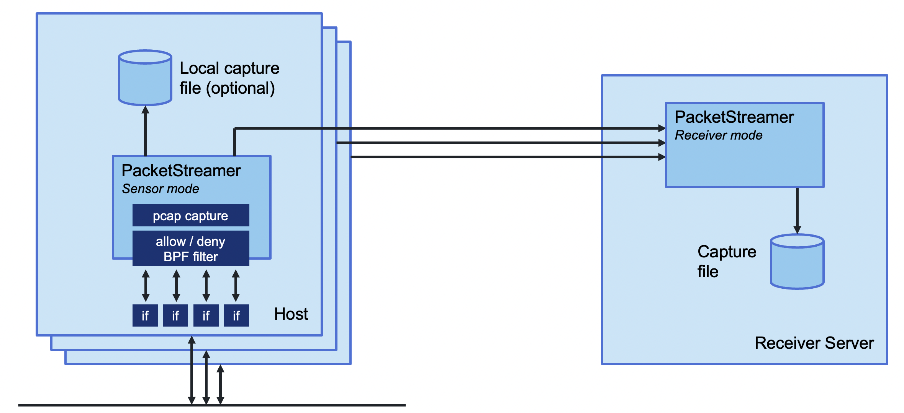

# PacketStreamer

Deepfence PacketStreamer is a high-performance remote packet capture and
collection tool. It is used by Deepfence's [ThreatStryker](https://deepfence.io/threatstryker/)
security observability platform to gather network traffic on demand from cloud
workloads for forensic analysis.

## Primary design goals:

* Stay light, capture and stream, no additional processing
* Portability, works across **virtual machines, Kubernetes and AWS Fargate**. Linux
  and Windows

## Architecture

PacketStreamer **sensors** are started on the target servers. Sensors capture
traffic, apply filters, and then stream the traffic to a central reciever.
Traffic streams may be compressed and/or encrypted using TLS.

The PacketStreamer **receiver** accepts PacketStreamer streams from multiple
remote sensors, and writes the packets to a local `pcap` capture file

|  |
| :--: | 
| *PacketStreamer sensors forward packets to a PacketStreamer receiver* |

PacketStreamer sensors collect raw network packets on remote hosts. It selects packets
to capture using a BPF filter, and forwards them to a central reciever process
where they are written in pcap format.  Sensors are very lightweight and impose
little performance impact on the remote hosts. PacketStreamer sensors can be
run on bare-metal servers, on Docker hosts, and on Kubernetes nodes.

The PacketStreamer receiver accepts network traffic from multiple sensors,
collecting it into a single, central `pcap` file.  You can then process the 
pcap file or live feed the traffic to the tooling of your choice, such as
`Zeek`, `Wireshark`, `Suricata`, or as a live stream for Machine Learning models.

## When to use PacketStreamer

PacketStreamer meets more general use cases than existing alternatives. For
example, [PacketBeat](https://github.com/elastic/beats/tree/master/packetbeat)
captures and parses the packets on multiple remote hosts, assembles
transactions, and ships the processed data to a central ElasticSearch
collector. [ksniff](https://github.com/eldadru/ksniff) captures raw packet
data from a single Kubernetes pod.

Use PacketStreamer if you need a lightweight, efficient method to collect raw
network data from multiple machines for central logging and analysis.
